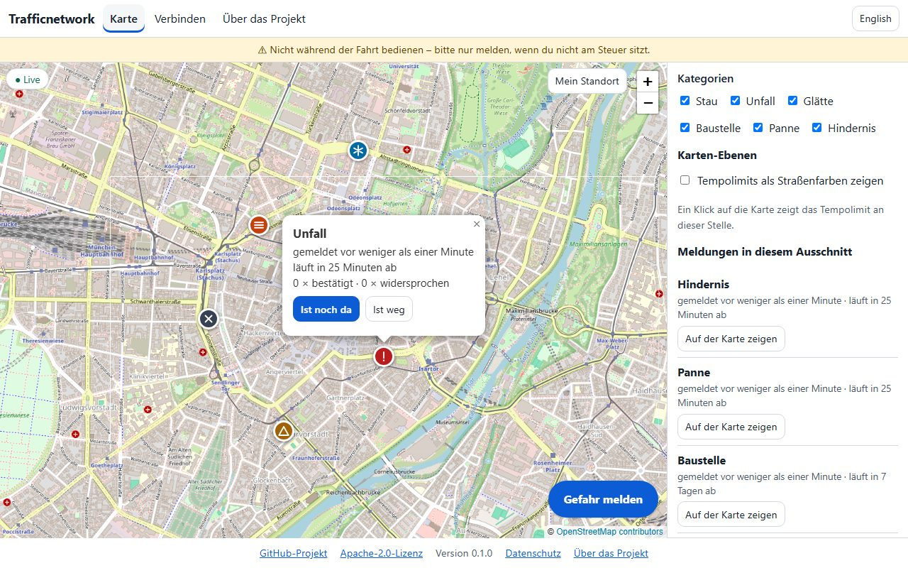
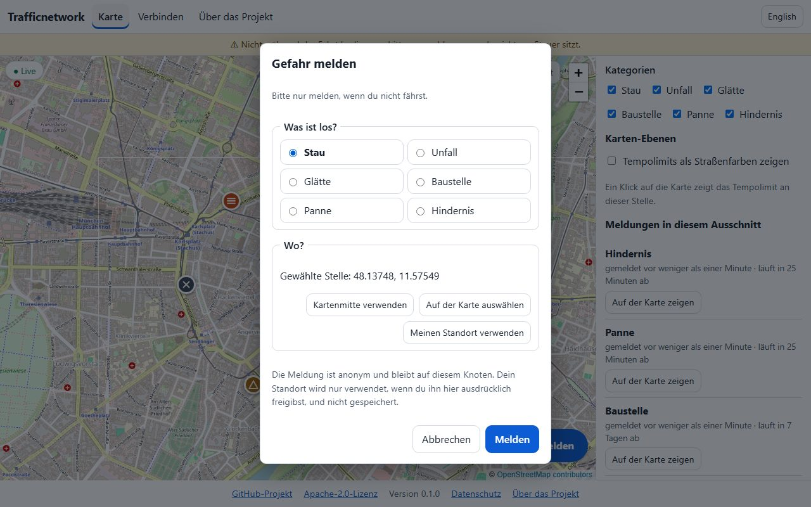
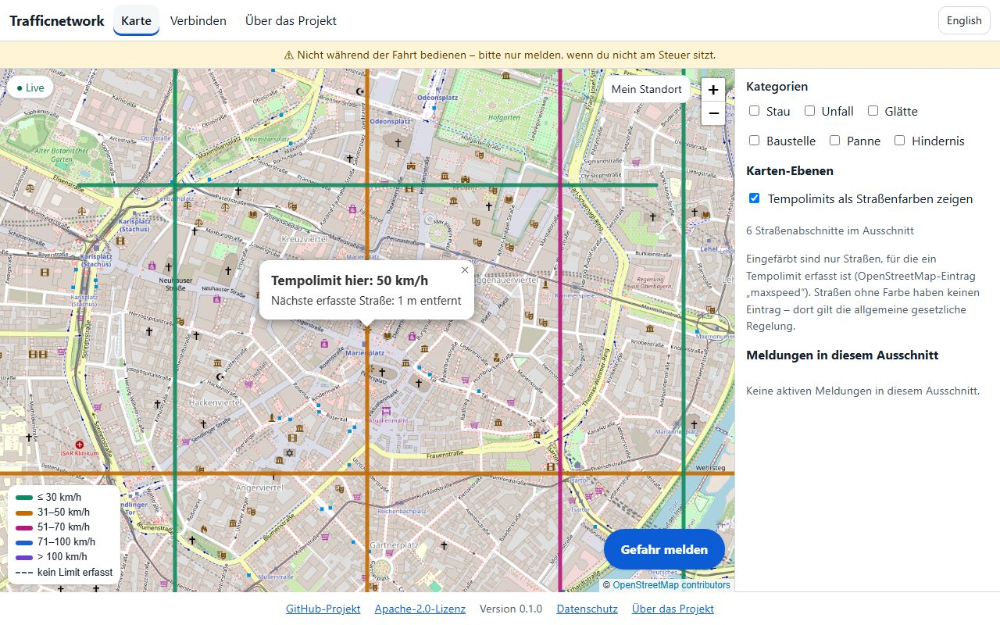
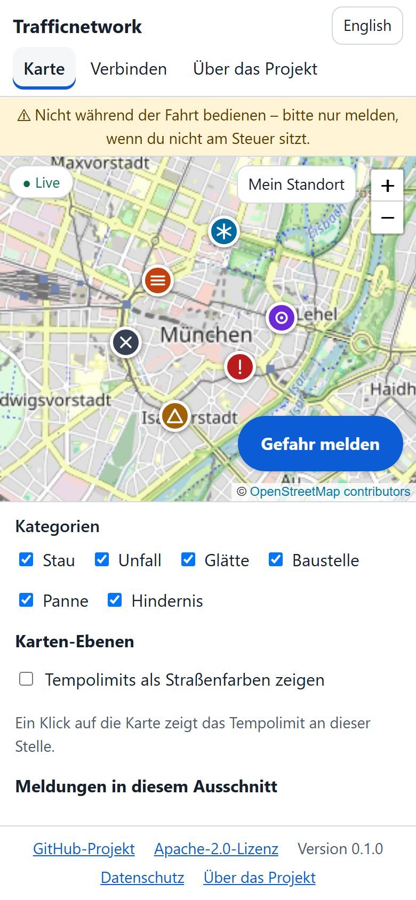

# Web UI

Every node serves a small, self-contained web page of its own: a **map** with the current hazard reports (live), a
**speed-limit lookup** by clicking the map, **reporting** and **confirming** hazards, a **"Connect"** page for app
developers, node operators and API users, and an **"About"** page with the project link. It is an add-on: the `/v1` API is
unchanged (one additive endpoint, `POST /v1/web/session`), and with `WEB_UI_ENABLED=false` the node serves the API only.

| Map (desktop) | Report dialog |
|---|---|
|  |  |

| Speed limits | Phone |
|---|---|
|  |  |

More: [dark mode](web-ui/map-dark.jpg), [online display](web-ui/online-display.jpg) (mock data), [Connect page](web-ui/connect.png), [About page](web-ui/about.png).
The images are regenerated with `npm run e2e:screenshots` (see [Tests](#tests)); they show the end-to-end suite's synthetic
test data (a few straight streets and six reports in Munich) on real map tiles — a real node shows the roads its own data has.

## Switching it on and off

| Variable | Default | Meaning |
|---|---|---|
| `WEB_UI_ENABLED` | `true` | `false` = the node serves the API and nothing else: `/`, `/connect`, `/about`, `/web/*`, `/web-config.json` and `POST /v1/web/session` do not exist (404). |
| `PROJECT_REPO_URL` | `https://github.com/Romsmo/Trafficnetwork` | The project link on the About page and in the footer. Change it for a fork. |
| `MAP_TILE_URL` | empty = OpenStreetMap | Raster tile source with `{z}/{x}/{y}` (no `{s}`, no credentials, no API key — visitors can see the URL). `none` = no map background at all. See [Map tiles](#map-tiles). |
| `MAP_TILE_ATTRIBUTION_TEXT`, `MAP_TILE_ATTRIBUTION_URL` | OpenStreetMap | The attribution shown on the map. Keep whatever your tile provider requires. |
| `MAP_TILE_MAX_ZOOM` | `19` | Highest zoom level of the tile source. |
| `TRUST_PROXY` | empty | Behind a reverse proxy, see [Reverse proxy](#reverse-proxy). |
| `LOG_PRIVACY_MODE` | `true` | Request logs without query string (coordinates) and client address. |
| `WEB_SESSION_TTL_SECONDS` | `900` | Lifetime of an anonymous web session. |
| `WEB_SESSION_MINT_LIMIT_PER_MINUTE` | `20` | Sessions one IP may create per minute. |
| `WEB_REPORT_LIMIT_PER_SESSION` | `3` | Reports and confirmations per web session (within `REPORT_RATE_LIMIT_WINDOW_MINUTES`). |
| `WEB_REPORT_LIMIT_PER_IP_PER_HOUR` | `10` | Reports and confirmations per client IP and hour. |
| `WEB_REPORT_LIMIT_NODE_PER_HOUR` | `300` | Circuit breaker: all web sessions together. |
| `WEB_READ_LIMIT_PER_IP_PER_MINUTE` | `120` | Reads per client IP and minute. |
| `WEB_HEAVY_READ_LIMIT_PER_IP_PER_MINUTE` | `30` | Road-segment queries (the speed-limit layer) per client IP and minute. |
| `WEB_MAX_SEGMENT_RADIUS_M` | `1500` | Largest area the speed-limit layer may load (radius around the map centre). |
| `WEB_MAX_HAZARD_RADIUS_M` | `25000` | Largest area whose reports the map loads. Wider views show the reports around the centre and say so. |
| `WEB_WS_MAX_TILES_PER_CONNECTION` | `60` | Live-update subscriptions one web socket may hold. |

The Docker image contains the UI (`server/web` is copied into it); `docker-compose.yml` passes the variables through.

## What the visitor can do

* **Map** — the node's reports as markers (category icons, not just colours), a list next to or below the map, category
  filters, live updates over the node's WebSocket (a "Live" indicator shows the connection state), reports disappear when they
  expire. The map opens on the region the node has data for. Clicking it shows the speed limit at that spot.
* **Speed-limit layer** — road colours by limit (zoomed in far enough). Only roads that have a recorded limit exist in the
  data (OpenStreetMap `maxspeed`); other roads stay uncoloured and the legend says so ("no limit recorded" — the general legal
  rule applies there). The page never claims completeness.
* **Report** — choose a category, then the spot: the map centre, a spot picked on the map, or "use my location". The
  position is used **only after the visitor presses that button** (the browser then asks for permission), once, and is not
  kept. Everything works without location permission.
* **Confirm** — "still there" / "gone" on a marker. The page tells the truth about the outcome: counted, not counted (own
  report or already voted), or which limit was hit and when to retry.
* **Camera categories** (fixed/mobile speed cameras, red-light, distance control) exist in the page **only when the node's
  effective `speedCameraNamespaceEnabled` flag is on** (see `GET /v1/config`; the flag is already combined with the signed
  network config). With the flag off there is no such filter, no such report category, no such marker, and the node neither
  returns nor pushes such reports.
* **Connect** — three ways to use the network (own app with the client library, run your own node, call the API) with
  copyable `curl` examples containing this node's address, and the node's network status (node id, version, federation
  state, other known nodes). Code examples for the client library's platform bindings will follow when those exist.
* **About** — the project text, data sources, safety and privacy notice, and a prominent link to the project on GitHub.
* **Online display** — a small "N online" at the bottom right of every page once the node offers the counter, see below.
* German and English (browser language, switchable, remembered in `localStorage` — the only thing the page stores), mobile
  friendly, keyboard operable, WCAG 2 A/AA checked automatically (light and dark mode).

## "N online" display (add-on O-B)

Bottom right of every page (in the footer, so it never covers the map's controls) the page shows how many are online, e.g.
"● 12 online" or, under the node's threshold, "fewer than 5 online". A tap, click or Enter on it opens the details: this node's
figure, the **network figure — always labelled as an estimate** that adds up what other nodes report about themselves and is
not verified — and a note that only counting happens. It is text, not a colour signal (the dot is decoration), it is a native
`<details>` (keyboard operable, closes with Escape), it reserves its place so neither its first appearance nor a changing
number moves anything, and it stays out of the way on a phone.

**Status: built against a mock.** The server part (O-A, `GET /v1/stats/online`, `docs/prompt-addon-online-counter.md`) does not
exist yet, so the page follows the contract *proposed* there:

```json
{ "node": { "online": 12, "windowSeconds": 300 },
  "network": { "online": 87, "nodes": 4, "estimated": true, "asOf": "2026-09-24T10:15:00Z" },
  "minDisplayThreshold": 5 }
```

Below the threshold a figure is `"online": null` with `"below": 5` (or just `null`, then `minDisplayThreshold` applies); the page
also enforces the threshold itself and never shows an exact number under it. `{ "enabled": false }` means "switched off".
The reader (`parseOnlineStats` in `assets/js/online-badge.js`) is deliberately tolerant; **anything it does not understand
hides the display**. If O-A ends up with another shape, adapt that one function and its unit tests
(`tests/unit/web-online.test.ts`); the end-to-end tests (`e2e/online.spec.ts`) answer the endpoint with a mock until then.

Behaviour: one request when the page opens, then every 30 seconds (none while the tab is hidden; a refresh when it becomes
visible again). The request is the public one — no token, no cookie, so it does not use up a web session. If the node answers
401/403/404/405/410 (an older server) or `enabled: false`, the display disappears silently and the page stops asking; a passing
failure (network, 5xx, 429, unusable answer) hides it and it comes back when the node answers again. The browser logs a failed
request in its console; that is how a page finds out that a node has no counter (the end-to-end helper ignores exactly that URL).

## How the page talks to the node

Every `/v1` read needs a Bearer token and a web page cannot keep a secret. So the page asks the node for an **anonymous
web session**: `POST /v1/web/session` returns an ordinary JWT (`sub = "web:<16 random bytes>"`, scope `client`, lifetime
`WEB_SESSION_TTL_SECONDS`). No database row, no credential, nothing that links two sessions of the same browser (each renewal
is a new identity — which is why the meaningful limits are per IP, not per session).

What a web session may do is decided by a **default-deny allowlist** (`src/modules/web/guard.ts`), not by its scope. It may:

* `GET /v1/config`, `/v1/speed-limit`, `/v1/hazard-reports/nearby` and `/by-tile`, `/v1/speed-cameras/nearby` and `/by-tile`,
  `/v1/speed-limit-segments/nearby` (the last two with the radius caps above),
* `POST /v1/hazard-reports` (without `deviceAssertion`; camera categories only when the node enables them),
* `POST /v1/hazard-reports/:id/confirmations`,
* the `/v1/ws` handshake (with the subscription cap).

Everything else — snapshot/delta/static-data downloads, device registration, bulk import, federation, every endpoint that will
ever be added — is refused with `403 WEB_SESSION_FORBIDDEN`. Limits (per session, per IP, per node) are counted in memory in
`src/modules/web/limits.ts`; a refused request says which limit was hit and when to retry (`429`, `Retry-After`).
`POST /v1/web/session` refuses requests that a browser labels as coming from another site (`Sec-Fetch-Site`), so a foreign page
cannot make its visitors spend their IP's quota.

## Trust model

* **Web reports stay on this node.** They carry no device signature, so they are never federated; federation reputation exists
  per node, not per device, so an anonymous web visitor cannot be given one. Reports made by apps with a registered device
  identity are unaffected.
* A visitor is anonymous: the reporter identity stored with a report is the throw-away session id, and **reporter ids are
  removed from every HTTP response and live event a web session receives**.
* Anyone can open a page, so the limits above are the protection against abuse. There is deliberately no proof-of-work or
  CAPTCHA in this version; the node operator can lower the limits or put a WAF/CDN in front.
* The page ships **no secret** and no third-party code. The only external request it ever makes is for map tiles (and only to
  the configured tile origin). The Content-Security-Policy (`default-src 'none'`; scripts, styles, fonts and connections from the
  node itself; images from the node, `data:` and the tile origin) is built per request from the configuration, and
  `X-Frame-Options`, `nosniff`, `Referrer-Policy` and `Permissions-Policy` (geolocation for the page itself only) are set.

## Map tiles

The default is OpenStreetMap's public tile server (`https://tile.openstreetmap.org`). Summary of its usage policy
(<https://operations.osmfoundation.org/policies/tiles/>, read 2026-09-23 — check the current text before relying on this):
interactive use by a web page is fine; **no bulk downloading or prefetching, no offline use**; a visible attribution is
required; requests must carry a valid `Referer`/User-Agent (a browser page does); the service is best-effort and may block
heavy users. That fits a small node. A node with real traffic should use **its own tile server or a commercial tile
service** (set `MAP_TILE_URL`; no API key in the URL — use a provider that restricts by referrer, or run your own) and adapt
the attribution. Visitors' browsers load tiles directly from that origin, so the tile provider sees their IP address and the
map area — the About page says so, and `MAP_TILE_URL=none` avoids it entirely (the page then talks to nobody but the node).
Vector tiles/MapLibre were considered and rejected for now: a 20 MB dependency for no benefit at this scale.

## Reverse proxy

Behind Caddy, nginx or Apache every client looks like the proxy, so per-IP limits would be shared by everybody. Set
`TRUST_PROXY` to a hop count (`1`), a list of proxy IPs/CIDRs, or `true` (only if the node is reachable **only** through the
proxy). The proxy must forward the `Host` header (the CSP names this host for the WebSocket) and upgrade WebSocket requests on
`/v1/ws` (`mod_proxy_wstunnel` for Apache; the CI smoke test covers it). Terminate TLS at the proxy; the page then uses `wss://`.

## Privacy

No account, no cookies, nothing tracked. The page stores the chosen language in `localStorage`. Access logs contain no
coordinates and no client addresses (`LOG_PRIVACY_MODE`; the About page tells visitors when an operator turned this off).
The visitor's IP address is held in memory for the limits and never written to the database. A report stores only its spot,
type and times. See [`docs/privacy.md`](../../docs/privacy.md) for the privacy notice draft (it is not legal advice; operators
remain responsible for their own notice).

## Performance

The page is built to load quickly on a slow phone connection and to zoom smoothly (measured with a simulated 4G connection
and a 4× throttled CPU, first visit / repeat visit: map on screen about 1.5 s / 0.5 s, first tile about 3.2 s / 0.7 s;
before these changes 2.3 s / 1.6 s and 4.2 s / 1.8 s):

* No build step. The server reads the files once at startup, gives every asset an ETag, and serves Brotli/gzip variants.
* **Versioned URLs.** At startup a fingerprint of all files (`buildId`) is appended to every link between pages and scripts
  (`?v=<buildId>`; a missing import fails the startup, not a visitor). Requests that carry the current id are cached for a
  year (`immutable`), everything else is revalidated — so a repeat visit needs no request for the app's files, and a new
  release changes every URL.
* **Preload hints** generated from the modules' imports (`modulepreload`), a `preload` of `/web-config.json` and, on the map
  page, a `preconnect` to the tile server: the browser starts everything in parallel instead of discovering it step by step.
* The map appears as soon as the web config is known; the node's settings, the first reports, the live connection and the
  session are requested in parallel. The tile-name library (`h3-js`, the biggest file) is loaded after the first tiles.
* Zooming is continuous (no snapping to whole levels, about one level per wheel notch), tiles are requested while panning and
  only for the level a zoom ends on, superseded requests are cancelled, and reports and road segments are loaded with a margin,
  so small pans and zooming in are answered from what is already loaded. The side panel has a fixed height so the map never
  changes size while the visitor uses it.

## Code layout

```
server/web/public/pages/     index.html, connect.html, about.html
server/web/public/assets/    css/app.css, js/*.js (ES modules), i18n/{de,en}.js, img/
server/src/modules/web/      plugin.ts (routes), static.ts (asset table, versioning), guard.ts (allowlist + limits),
                             session.ts, csp.ts, region.ts (where the map opens), tile.ts, limits.ts, redact.ts
```

Leaflet 1.9.4 (BSD-2-Clause) and `h3-js` are served from `node_modules` under `/web/vendor/…`. To add a language, add
`web/public/assets/i18n/<code>.js` with the same keys as `de.js` (a unit test enforces key parity) and register it in
`assets/js/i18n.js`.

## Tests

| What | Command | Notes |
|---|---|---|
| Unit | `npm run test:unit` | i18n parity, guard/limits, CSP, static asset table, frontend helpers, the online display's reader and polling |
| Integration | `npm run test:integration` | real PostGIS via Testcontainers: session, allowlist, limits, camera flag, WebSocket push, `WEB_UI_ENABLED=false` |
| End-to-end | `npm run e2e` | real Chromium against real node processes and PostGIS (Testcontainers), `npx playwright install chromium` once |
| Screenshots | `npm run e2e:screenshots` | regenerates `docs/web-ui/*` (needs internet: real map tiles) |

The end-to-end suite checks, among others: nothing but the node and map tiles is requested, no CSP violation or console error,
the map works without location permission and the position is requested only after a button press, report → marker → live
update in a second browser → confirmation, speed limit on click, camera categories absent when the flag is off (and present
when on), honest limit messages, `WEB_UI_ENABLED=false`, mobile width without horizontal scrolling, axe accessibility audits
(light/dark), keyboard operation, and the loading/zooming behaviour described above. CI runs it as the `e2e` job.
